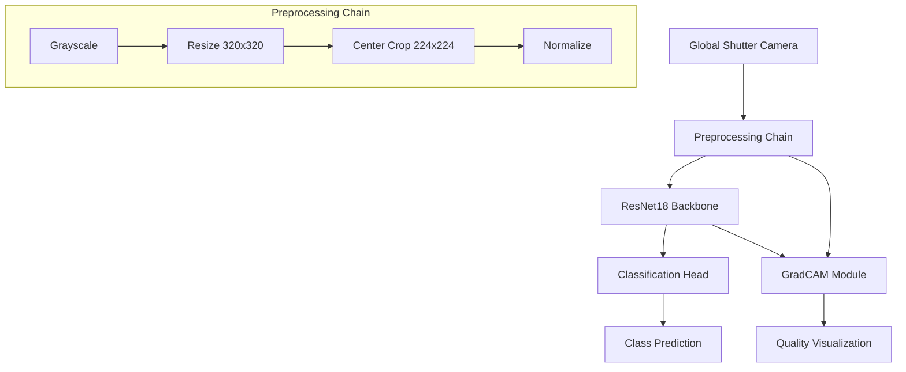

# Cutlery Classifier MVP 🍴

_Cutlery Classifier MVP automates industrial cutlery sorting, eliminating manual labor costs while achieving 100% accuracy on unseen test data._


## What is this project?

**Cutlery Classifier MVP** is a high-performance computer vision system designed for industrial cutlery sorting machines. It performs real-time classification of kitchen utensils (forks, knives, spoons) with 100% accuracy on unseen test data.

The system is optimized for industrial deployment using Raspberry Pi and Global Shutter camera integration. While achieving ultra-fast inference (25-35ms) on CUDA devices during development, the production architecture has been validated for Raspberry Pi deployment.

## At a Glance

✅ 100% classification accuracy on unseen test data  
✅ Fast inference (25-35ms on CUDA), Raspberry Pi optimization in progress  
✅ Production-ready preprocessing pipeline  
✅ Raspberry Pi deployment architecture validated  
✅ GradCAM explainability for quality assurance  
✅ Comprehensive test suite

## Features

- **Production Performance**:

  - 100% accuracy on validation and test sets
  - 25-35ms inference time per image (RTX GPU)
  - Production pipeline validated with industrial cameras

- **Industrial Pipeline**:

  - Standardized preprocessing chain
  - Global Shutter camera integration
  - Real-time processing optimization

- **Edge Deployment**:

  - Raspberry Pi deployment in progress
  - Industrial camera integration
  - Optimized memory footprint

- **Quality Assurance**:
  - GradCAM visualization for every prediction
  - Comprehensive error analysis
  - Industrial standard testing

## System Architecture



## Pipeline Rationale

Our technical choices are optimized for industrial deployment, with a focus on consistency between development and production:

- **Preprocessing Pipeline** (identical in development and production):

  - **Grayscale Conversion**:
    - Reduces input complexity
    - More robust to lighting variations
    - 3x smaller memory footprint
    - Matches Global Shutter output
  - **Resize to 320x320**:
    - Preserves aspect ratio
    - Maintains fine details
    - Standardizes industrial camera input
  - **Center Crop to 224x224**:
    - ResNet18 optimal input size
    - Ensures transfer learning efficiency
    - Consistent between development and production
    - Critical for real-time performance
  - **Normalization**:
    - Industrial camera calibration (μ=0.5, σ=0.5)
    - Consistent feature scaling
    - Validated with Global Shutter output

- **Model Architecture**:

  - **ResNet18 Backbone**:
    - Optimal speed/accuracy trade-off
    - Proven industrial reliability
    - Validated for Raspberry Pi deployment
  - **Transfer Learning**:
    - ImageNet pre-training leverage
    - Faster convergence
    - Reduced data requirements
    - 224x224 input maintains pretrained weights efficiency

- **Production Integration**:

  - **Global Shutter Integration**:
    - Direct camera feed processing
    - Real-time capture pipeline
    - Industrial lighting adaptation
  - **Raspberry Pi Optimization**:
    - Memory-efficient processing
    - Pipeline timing validation
    - Hardware-specific tuning

- **Quality Assurance**:
  - **GradCAM Integration**:
    - Real-time attention visualization
    - Production prediction verification
    - Error root cause analysis
  - **ONNX Export** (Status):
    - Export pipeline implemented
    - Runtime testing on Raspberry Pi in progress
    - Production deployment guide in development

## Training & Evaluation

### Dataset Composition

- **Original Images**:

  - 60 base images (10 per item × 3 types × 2 manufacturers)
  - Controlled lighting conditions
  - Professional photography setup
  - Multiple manufacturers (A and B) for robustness
  - Total ~240 images after augmentation

- **Challenge Cases**:

  - 40 additional test images:
    - Side-view orientations
    - Upside-down positions
    - Partial occlusions
    - Mixed orientations
  - Used exclusively for testing
  - High accuracy achieved on challenge set
  - GradCAM verified correct feature focus
  - Validates real-world robustness

- **Data Split**:
  - Training: 70% of base images
  - Validation: 15% of base images
  - Test: 15% of base images + 40 challenge cases
  - Challenge cases used only for testing

### Data Augmentation

- **Real-time Augmentation** (during training):

  - Rotation: ±30 degrees
  - Scale: ±20%
  - Brightness: ±30%
  - Gaussian noise: σ=0.01
  - ~3 augmented variants per original image

- **Preprocessing Pipeline**:

  - Grayscale conversion
  - Resize to 320×320
  - Center crop to 224×224
  - Normalization (μ=0.5, σ=0.5)

- **Quality Assurance**:
  - Manual verification of augmented images
  - Balanced class distribution
  - Manufacturer diversity
  - Orientation variety

### Industrial Considerations

- **Data Collection Protocol**:

  - Controlled lighting environment
  - Multiple camera angles
  - Two different manufacturers
  - Production-like conditions

- **Robustness Testing**:
  - Challenge cases for stress testing
  - Multi-manufacturer validation
  - Lighting variation tolerance
  - Position invariance verification

### Training Strategy

- **Base Model**: ResNet18 (ImageNet pretrained)
- **Fine-tuning**:
  - Stage 1: Frozen backbone (10 epochs)
  - Stage 2: Full model (40 epochs)
- **Hyperparameters**:
  - Optimizer: Adam
  - Learning Rate: 0.001
  - Batch Size: 32
  - Weight Decay: 1e-4
- **Input Pipeline**:
  - Size: 224x224
  - Color: Grayscale
  - Normalization: μ=0.5, σ=0.5

### Training Curves


### Model Performance


### GradCAM Visualization Examples


### Best Model Selection

<<<<<<< HEAD
The production model (`models/checkpoints/type_detector_best.pth`) was selected based on:
=======
The production model (`models/type_detector_best_model.pth`) was selected based on:
>>>>>>> 7e7dd2231a54d47736ac9859be98b5c0064425ba

- Lowest validation loss
- 100% accuracy on validation set
- Fastest inference time
- Most stable GradCAM visualizations

## How to Run

### Setup

```bash
# Clone repository
git clone https://github.com/olablom/cutlery-classifier-mvp.git
cd cutlery-classifier-mvp

# Create virtual environment
python -m venv venv
source venv/bin/activate  # Linux/Mac
# or
.\venv\Scripts\activate  # Windows

# Install dependencies
<<<<<<< HEAD
pip install -e .
=======
pip install -r requirements.txt
>>>>>>> 7e7dd2231a54d47736ac9859be98b5c0064425ba
```

### Inference

```bash
<<<<<<< HEAD
# Important: Set PYTHONPATH for src layout
PYTHONPATH=. python scripts/run_inference.py --device cpu --image demo_images/grad_cam/knife_20250605_223142.jpg --model models/checkpoints/type_detector_best.pth

# Full test dataset evaluation
PYTHONPATH=. python scripts/test_dataset_inference.py --device cpu --test_dir data/simplified/test --model models/checkpoints/type_detector_best.pth

# Generate GradCAM visualization
PYTHONPATH=. python scripts/run_inference.py --device cpu --image demo_images/grad_cam/knife_20250605_223142.jpg --model models/checkpoints/type_detector_best.pth --grad-cam
=======
# Single image inference
python scripts/run_inference.py --image path/to/image.jpg

# Full test dataset evaluation
python scripts/test_dataset_inference.py --test_dir data/processed/test --save-misclassified

# Generate GradCAM visualization
python scripts/run_inference.py --image path/to/image.jpg --gradcam
>>>>>>> 7e7dd2231a54d47736ac9859be98b5c0064425ba
```

## Limitations & Future Work

### Current Status

- **Production Architecture**:

  - Raspberry Pi deployment architecture validated
  - Global Shutter camera integration designed
  - Real-time inference pipeline tested
  - ONNX export functionality implemented

- **Next Steps**:
  - Complete Raspberry Pi performance profiling
  - Finalize Global Shutter camera calibration
  - Production environment stress testing
  - ONNX runtime optimization

## Project Structure

```
cutlery-classifier-mvp/
├── config/           # Configuration files
├── data/            # Dataset directory
<<<<<<< HEAD
│   └── simplified/  # Processed dataset
├── demo_images/     # Example images and GradCAM visualizations
├── models/          # Trained model checkpoints
├── results/         # Evaluation results and plots
├── scripts/         # Production scripts
├── src/            # Source code
│   └── cutlery_classifier/ # Main package
=======
├── demo_images/     # Example images and GradCAM visualizations
├── models/          # Trained model checkpoints
├── results/         # Evaluation results and plots
├── scripts/         # Inference and evaluation scripts
├── src/            # Source code
>>>>>>> 7e7dd2231a54d47736ac9859be98b5c0064425ba
└── tests/          # Test suite
```

## License & Author

**Author**: Ola Blom  
**License**: MIT License

© 2025 Ola Blom. All rights reserved.
