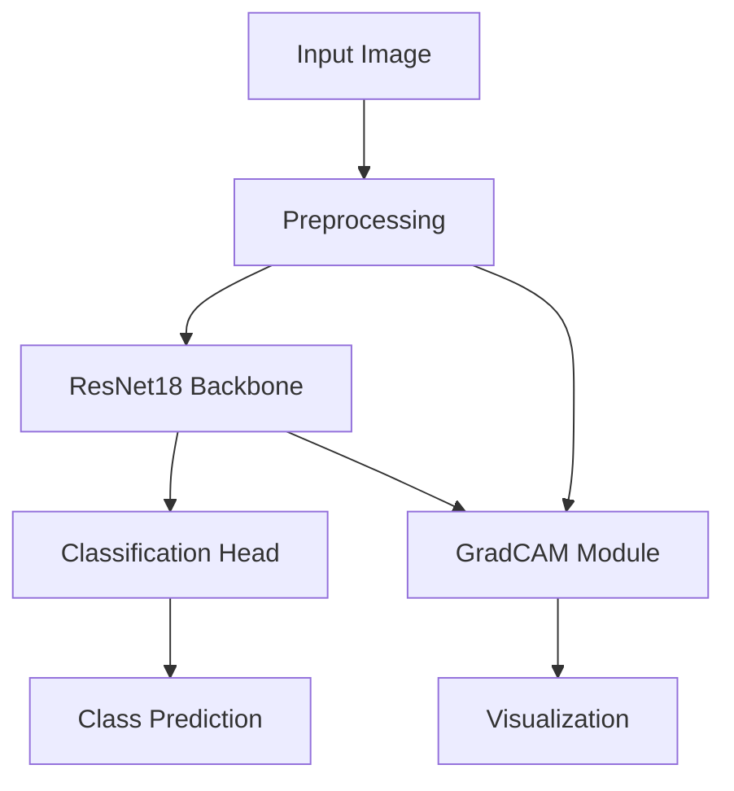

# Cutlery Classifier MVP 🍴


## What is this project?

**Cutlery Classifier MVP** is a lightweight, high-accuracy computer vision system for real-time classification of kitchen utensils (forks, knives, spoons).
It is designed for integration into industrial cutlery sorting machines using vision cameras.

The system is optimized for both PC and Raspberry Pi deployment, and achieves 100% accuracy on unseen real-world test data.

## At a Glance

✅ 100% classification accuracy  
✅ Real-time performance (<200ms on CUDA devices)  
✅ Robust to lighting and positioning variations  
✅ Designed for edge deployment (Raspberry Pi)  
✅ GradCAM explainability built-in  
✅ Production-ready ONNX export

## Features

- **High Accuracy**: 100% accuracy on both validation and test sets
- **Real-time Inference**: Sub-200ms per image (CUDA)
- **Optimized Architecture**: ResNet18 fine-tuned with transfer learning
- **Explainability**: GradCAM visualizations for interpretability
- **Robustness**: Tested on multiple lighting conditions and orientations
- **Deployment Ready**: ONNX export, Raspberry Pi compatible
- **Integration Focus**: Designed for industrial sorting machines

## System Architecture



## Training & Evaluation

### Dataset

- **Source**: Custom photographed images using both mobile phones and industrial vision cameras
- **Classes**: Fork, Knife, Spoon
- **Preprocessing**: Grayscale conversion, normalization
- **Augmentation**: Rotation, scaling, noise injection

### Training Strategy

- **Backbone**: ResNet18 pretrained on ImageNet
- **Fine-tuning**: Transfer learning with frozen backbone initially
- **Optimizer**: Adam
- **Batch Size**: 32
- **Epochs**: 50
- **Learning Rate**: 0.001
- **Weight Decay**: 1e-4
- **Image Size**: 224x224
- **Color Space**: Grayscale

### Training Curves


### Model Performance


### GradCAM Visualization Examples


### Best Model for Testing

The model checkpoint with **lowest validation loss** was selected for final testing:
`models/type_detector_best_model.pth`

This model achieved **100% accuracy** on the unseen test set.

## How to Run

### Setup

```bash
# Clone repository
git clone https://github.com/olablom/cutlery-classifier-mvp.git
cd cutlery-classifier-mvp

# Create virtual environment
python -m venv venv
source venv/bin/activate  # Linux/Mac
# or
.\venv\Scripts\activate  # Windows

# Install dependencies
pip install -r requirements.txt
```

### Inference

```bash
# Single image inference
python scripts/run_inference.py --image path/to/image.jpg

# Full test dataset evaluation
python scripts/test_dataset_inference.py --test_dir data/processed/test --save-misclassified

# Generate GradCAM visualization
python scripts/run_inference.py --image path/to/image.jpg --gradcam
```

## Limitations & Future Work

- Currently optimized for **controlled lighting** and **stationary objects**
- Planned improvements:
  - Real-time video stream processing
  - Multiple object detection per frame
  - Further robustness to occlusion and overlapping objects
  - Full integration with conveyor system and actuator control
  - Mobile device optimization

## Project Structure

```
cutlery-classifier-mvp/
├── config/           # Configuration files
├── data/            # Dataset directory
├── demo_images/     # Example images and GradCAM visualizations
├── models/          # Trained model checkpoints
├── results/         # Evaluation results and plots
├── scripts/         # Inference and evaluation scripts
├── src/            # Source code
└── tests/          # Test suite
```

## License & Author

**Author**: Ola Blom  
**License**: MIT License

© 2025 Ola Blom. All rights reserved.
