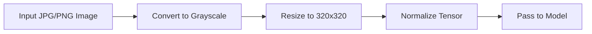

# System Architecture: Cutlery Classifier MVP

This document outlines the system architecture of the MVP version of the Cutlery Classifier project, as well as the planned full production version. The architecture is modular, scalable, and optimized for embedded deployment with grayscale image input.

---

## 🎯 MVP Scope (Academic Project)

The MVP is structured around a **two-stage hierarchical classification pipeline**:

```mermaid
flowchart TD
    A[Input Image] --> B[Preprocessing (Resize, Grayscale, Normalize)]
    B --> C[Type Classifier (fork/knife/spoon)]
    C --> D{Type?}
    D -->|fork| E[Fork Classifier (IKEA, OBH, Fiskars)]
    D -->|knife| F[Knife Classifier (Placeholder)]
    D -->|spoon| G[Spoon Classifier (Placeholder)]
    E --> H[Predicted Manufacturer]
    F --> H
    G --> H
```

---

## 🧱 Component Overview

### 🔹 `type_detector.py`

- Model: **ResNet18**
- Input: Grayscale 320×320
- Output: 3 classes (fork, knife, spoon)

### 🔹 `manufacturer/*.py`

- Model: **MobileNetV2** (planned)
- One model per utensil type
- Input: same preprocessed image
- Output: Manufacturer class (e.g. IKEA, OBH, Fiskars)

### 🔹 `inference_pipeline.py`

- End-to-end orchestration:

  - Preprocess image
  - Run type classifier
  - Dispatch to correct manufacturer model

---

## ⚙️ Preprocessing Flow



---

## 🔮 Production Roadmap (LIA Extension)

### Additional Features:

- 📦 Add full manufacturer classifiers (knife/spoon)
- 🧠 Optimize MobileNetV2 for edge inference (quantization, pruning)
- 🎥 Integrate webcam or real-time camera for live sorting
- 🖥️ Deploy to Raspberry Pi with ONNX-runtime
- 🤖 Add natural language interface via local LLM or API (e.g. "sort only IKEA forks")

---

## 📁 Directory Structure

```text
src/
├── pipeline/
│   ├── type_detector.py
│   └── manufacturer/
│       ├── fork_classifier.py
│       ├── knife_classifier.py  # Placeholder
│       └── spoon_classifier.py  # Placeholder
├── training/
│   ├── train_type_detector.py
│   └── train_manufacturer.py
├── inference/
│   └── inference_pipeline.py
```

---

## 🧪 Evaluation and Visualization

- Accuracy, Precision, Recall
- Confusion Matrix
- Grad-CAM visualizations for type classifier and manufacturer model
- Optional: Create GIF/timelapse of Grad-CAM changes across epochs

---

## 📌 Notes

- All models use grayscale input for compute efficiency
- YAML-driven configuration for model selection and training parameters
- Training/export formats: `.pt`, `.onnx`

---

Next: Implement model factory, train type classifier, and verify pipeline!
